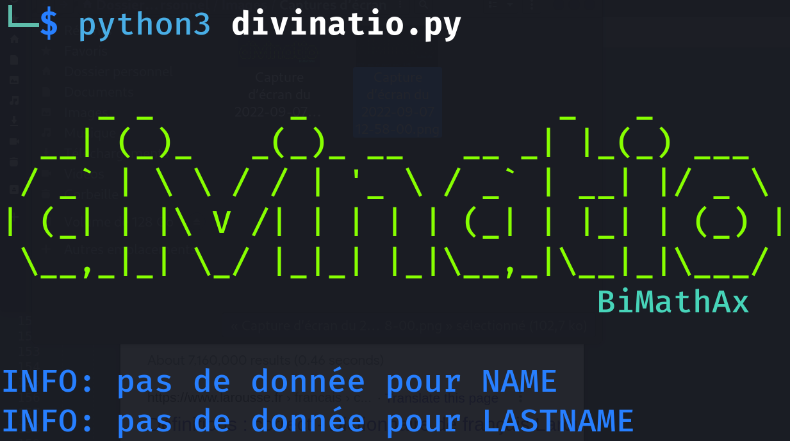

# Divinatio




Divinatio est un outil permettant de créer des listes de mots de passe plausibles en fonction d'informations sur une personne (nom, prénom, animaux de compagnies...).

*Par exemple : cette liste de mot de passe peut être utilisée par john-the-ripper pour cracker un hash ```john --wordlist="password.txt" --type=crypt unshadowed.txt```*

## Téléchargement

```
git clone https://github.com/MathKode/Divinatio.git
```
```
python3 divinatio.py -h
```

## Pourquoi Divinatio ?

Pourquoi utiliser divinatio et pas rockyou comme liste de mot de passe ?
- Divinatio est 100% personnalisable
- Les mots de passe générés sont beaucoup plus cohérent que rockyou

*En effet, si la personne se nomme Elias alors tous les mots de passe contenant John sont inutiles... Soit 18 729 mots de passe rockyou inutiles...*

- Cela vous fait gagner du temps (comparer a des listes déjà toutes faites mais non ciblées)
- Vous utilisez les données recueillies en OSINT

## Comment fonctionne Divinatio

Le fonctionnement *basique* de Divinatio est très simple et se base sur 3 fichiers :
- ```divinatio.py``` : code principal permettant la génération des passwords
- ```information_sheet.conf``` : feuille de renseignement sur la personne (*c'est ici où l'on définit le nom/prénom/naissance/animaux/villes...*)
- ```password_template.conf``` : modèle définissant l'ordre de génération des mots de passe (*Par exemple, on génère d'abord les variantes du prénom, puis du nom, puis du prénom et du nom, puis on ajoute l'année de naissance...*)

Ainsi pour une **utilisation très simple** vous devez remplir le fichier ```information_sheet.conf``` avec les informations trouvées sur la personne. Puis vous exécutez le code en définissant une ```fin``` (appelée *end*).

*En effet, Divinatio génère une infinité de mot de passe ! Il commence avec les modèles du fichier ```password_template.conf``` puis enchaîne avec un brute-force classique... Il n'y a donc pas de fin !*

**Définir un arrêt**, une fin à la génération de mot de passe peut se faire de 2 manières :
- ```-e <NB>``` : s'arrête une fois que le code a généré **<NB>** mot de passe
- ```-es <Mo>``` : s'arrête une fois que le fichier final a une taille > **<Mo>**

Ainsi, une fois que vous avez configuré ```information_sheet.conf``` et que vous voulez arrêter le script après la génération de 20 000 mot de passe, il faut entrer la commande :

```
python3 divinatio.py -e 20000
```

## Les Arguments

Divinatio possède plusieurs arguments que vous pouvez afficher via ```python3 divinatio.py --help```. Nous allons ici détailler leur fonction :

- ```-f <name>```
Si vous voulez créer vos propres fiches de renseignement (et ne pas utiliser ```information_sheet.conf```), vous devez les spécifier via cette commande. Exemple :

```
python3 divinatio.py -e 20000 -f personne1.conf
```

- ```-fs <name>```
Si vous souhaitez créer un moule, un modèle différent de celui par défaut (```password_template.conf```), vous devez spécifier le nom du fichier via cette commande. Exemple :

```
python3 divinatio.py -e 20000 -fs my_password_template.conf
```

- ```-o <name>```
Permet de définir le nom du fichier de sorti (par défaut *password.txt*). Exemple :

```
python3 divinatio.py -es 0.5 -o wordlist_to_mike.txt
```

- ```-v```
Cet argument de verbose permet d'afficher la taille du fichier de sorti en temps réel lors de la génération de mot de passe.

```
python3 divinatio.py -es 0.3 -v
```

- ```-e <NB>```
Arrête le code une fois que **<NB>** mot de passe ont été généré.

```
python3 divinatio.py -e 100
```

- ```-es <Mo>```
Arrête le code une fois que le fichier final a une taille > **<Mo>**

```
python3 divinatio.py -es 0.5
```

- ```-et```
Arrête le code une fois que toutes les combinaisons de mot de passe du fichier password_template.config ont été réalisées

```
python3 divinatio.py -et -fs other_template/form1.conf
```
## Créer son propre information\_sheet.conf

*Pour rappel, ce fichier correspond à une fiche de renseignement sur la personne dont on cherche à casser le mot de passe...*

- Pourquoi créer sa propre ``information_sheet.conf`` 

Savoir créer des fiches de renseignement peut être très utile si vous devez générer des listes de mots de passe pour de nombreuses personnes... Par exemple : plutôt que réécrire à chaque fois le fichier ```information_sheet.conf```, il est plus simple d'avoir un fichier pour chaque personne (``mike.conf``, ``theo.conf``, ``julien.conf``...)

- Syntaxe

La syntaxe pour créer une fiche est très simple car il n'y a que 2 types lignes !

**Les Commentaires** : qui sont ignorés lors de l'analyse du fichier par divinatio.py

```
[TABULATION]
[ESPACE]
#
```

**Les Renseignements** : correspondant à des *tags* signalant à divinatio.py qu'il s'agit d'une information sur la personne. 

```
NAME
LASTNAME
OTHERNAME
MAINPSEUDO
OTHERPSEUDO
DAYBIRTH
MONTHBIRTH
YEARBIRTH
IMPORTANTYEARS
YEARSINTERVALLE
NAMEANIMAL
CITYNAME
CITYNUMBER
SPECIALCHAR_BEGIN
SPECIALCHAR_MIDDLE
SPECIALCHAR_END
MINLEN
MAXLEN
```

Ainsi si on ne possède que le *prénom*, le *nom* et les *pseudos* utilisés notre fichier personnalisé ressemblera à :

```
#Mon fichier personnalisé !
NAME:mike
LASTNAME:horn
OTHERPSEUDO:zefus,miki
```

*Ce fichier peut être pris en compte avec l'argument ``-f``*

## Créer son propre modèle de mot de passe

Le fichier ```password_template.conf``` possède lui aussi une syntaxe particulièrement simple composé de 3 éléments :

- Commentaires : ce sont des lignes ignorées lors de l'exécution de divinatio.py (soit # - [ESPACE] [TABULATION])
- Modèles : composés du nom de l'information (voir la liste plus haut)

Entre chaque terme, il faut mettre un double point (:). Par exemple, si on veut le prénom suivit du nom, cela donne ```NAME:LASTNAME```

- Font : choisit le format d'écriture (quelles lettres est en MAJUSCULE, quelle lettre est en minuscule)

A chaque déclaration de font, les modèles situés en dessous prennent le format voulu. Pour déclarer une font il faut suivre le standar suivant ```FONT_STYLE:<number>```

Il existe 6 types de font possible :
```
Type 1 : MAJUSCULE
Type 2 : minuscule
Type 3 : First
Type 4 : lasT 
Type 5 : mINFIRST
Type 6 : All posibility
```

Voici un exemple de fichier modèle personnalisé pour ne faire que des mots de passe MAJUSCULE et dernière lettrE avec le nom et le prénom :

```
#Mon fichier de modèle
-Ceci aussi est un commentaire
FONT_STYLE:1,4
NAME
LASTNAME
NAME:LASTNAME
LASTNAME:NAME

FONT_STYLE:6
NAME:LASTNAME:LASTNAME
```

*Ce fichier peut être pris en compte avec l'argument ``-fs``*


